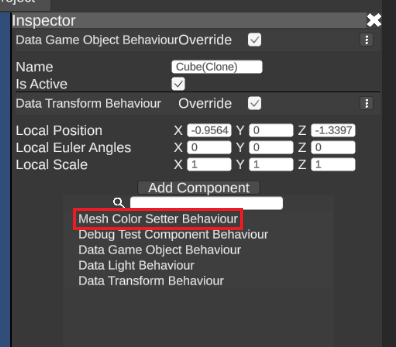
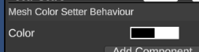

# Rundo
## Unity Runtime Editor - Inspector, Hierarchy, Undo

Rundo is a simple yet powerfull runtime editor made in Unity which allows for using Unity's editor basic (but most important) functions in the runtime.

### Features
- **Runtime environment** - Rundo editor and editor-playmode work in the runtime environment, which allows for the same code-base for the whole app-context (editor, editor-playmode, standalone playmode). No need to use `#if UNITY_EDITOR` branching.
- **Seamless playmode** - because everything run in the same runtime app-context, switching between editor/editor-playmode is basically instant which boosts prototyping/iterations a lot.
- **JSON serialization** - all data is serialized into a standardized JSON which is broadly supported - so it can be used for example to easily extract the logic part of the data to be used in the data validator on the server-side.
- **Undo system** - using underlaying commands system allows for keeping all data changes in the Undo stack. It is also a good practice to avoid modifying data directly, but by using commands. The same command system can be used in the playmode as well, so even playmode can use Undo stack which speeds the game development even more !
- **Tab system (multi-scene edit)** - Rundo editor supports tab system where you can open multiple scenes at the same time, with an option to copy/paste between tabs. Each tab has its own instance of UI, World, and an Undo stack.
- **Inspector** - system to draw UI elements for any object and its serializable fields/properties. Supports multi-edit (draws the same fields/properties over the set of objects). Supports Undo system and customization.
- **Unlimited UI/UX customization** - thanks to runtime environment, Rundo editor is not bounded by some predefined layout system. You can create any UI/UX over the underlaying data model. Rundo editor by default provides implementations of Inspector, Hierarchy and a Project windows.

# Overview

## Unity Objects Data Wrappers

Rundo Editor datamodel is completely separated from the Unity (you can basically create your own renderer over the data). This means that if you want to serialize native Unity object, there must be a data-only instance which keeps the Unity object's data and you are able to create a Unity object instance from this data. So for example instead of serializing GameObject itself, Rundo uses a data-only equivalent of the Unity GameObject from which is the the Unity GameObject instantiated.

Rundo Editor implements data-only objects for the three essential native Unity objects:
- Scene
- GameObject
- Component

### Scene

Unity Scene is represented as a `DataScene` for datamodel part and `DataSceneBehaviour` for view part.

```
class RootGameBehaviour
{
   var dataScene = RundoEngine.DataFactory.Instantiate<DataScene>();

    private void Start()
    {
        AddComponent<DataSceneBehaviour>().SetData(dataScene);
    }
}

```
`DataScene` is really simple, i its just a list of top-level game objects. `DataSceneBehaviour` then iterates through this top-level game objects and initiates instantiation of Unity GameObjects.

### GameObject

Unity GameObject is represented as a `DataGameObject` for datamodel part and `DataGameObjectBehaviour` for the view part.

This example instantiates an empty `DataGameObject` and puts it as a child into the `DataScene`.

We are only working with the data - the Unity GameObject itself is instantiated implicitly when the `CreateDataGameObjectCommand` is processed.

```
class RootGameBehaviour
{
   var dataScene = RundoEngine.DataFactory.Instantiate<DataScene>();

    private void Start()
    {
        AddComponent<DataSceneBehaviour>().SetData(dataScene);
        var go = DataGameObject.Instantiate();
        CreateDataGameObjectCommand.Process(dataScene, go);
    }
}

```

`DataGameObject` is similar to Unity GameObject - it is just a container for children game objects and components. You can work with the `DataGameObject` in a very similar way to the Unity GameObject - like adding/finding/removing components.

`DataGameObjectBehaviour` is component implicitly attached to the instantiated Unity GameObject which handles instantiating components and also provides an access to the `DataGameObject` from the Unity GameObject.

This example shows how to access datamodel from the Unity GameObject:
```
public void Validate(GameObject go)
{
    var dataGo = go.GetComponent<DataGameObjectBehaviour>().DataGameObject;
    ...
}
```

### Component

Unity Component is represented as a `DataComponent<T>` datamodel part. The view part is component itself, but it is a good practive to extend it from the `DataComponentMonoBehaviour`, which implements some usefull functions.

All your custom Unity components can be used in the Rundo Editor right-away without any code changes.

For example, we want a component that changes a color of some children mesh.

This is just a simple class extended from the MonoBehaviour - same as you would do in the Unity.
```
public class MeshColorSetterBehaviour : DataComponentMonoBehaviour
{
    private Color _color;
    private bool _invalidate;
    
    public Color Color 
    {
        get => _color;
        set
        {
            _color = value;
            _invalidate = true;
        }
    }
    
    private void Update()
    {
        if (_invalidate)
        {
            _invalidate = false;
            Refresh();
        }
    }
    
    private void Refresh()
    {
        GetComponentInChildren<MeshRenderer>().material.color = _color;
    }
}
```
To enable this component in the Rundo Editor, just add `[DataComponent]` attribute and as well as `[DataTypeId]` attribute, as this class is polymorhped.
```
[DataComponent]
[DataTypeId("5ab0ed5a-3ecc-4a1f-9984-2b808cea0993")]
public class MeshColorSetterBehaviour : DataComponentMonoBehaviour
{
    ...
}
```
Rundo Editor searches for the types with `[DataComponent]` attribute across the assemblies and shows them in the inspector in the Add Component dropdown.



Inspector now shows this component



We can change the color and use Undo/Redo


Even though the component data is kept separated from the component itself, it all works seamless.


## Data model

### Instantiation

To instantiate any data always use Rundo's `DataFactory`. Also it is a good practice to declare protected constructor for each of your own classes so the compiler forces you to use the external data factory.

```
public class Data
{
    public int Foo;
    
    protected Data() {}
}
```
To instantiate Data use the `DataFactory`
```
var dataInstance = RundoEngine.DataFactory.Instantiate<Data>();
```

### Child -> Parent hierarchy

Implementing `IParentable` interface provides your data with a child -> parent hierarchy system. Rundo editor implicitly sets this hierarchy in the JSON deserialization postprocess. And in the data instantiation process, you can provide a parent instance as an argument.

If you are able to, you can use `BaseData` class as a base class for your datamodel. BaseData class implements all common low-level data functions - just extend from this class and you can use everything right-away. Or check this class to see how to implement these common interfaces.
```
public class DataChild : BaseData {}
```
```
public class DataParent : BaseData
{
    public string Foo = "Foo";
    public DataChild Child;
}
```

Instantiate parent data
```
var dataParentInstance = RundoEngine.DataFactory.Instantiate<DataParent>();
```
Instantiate child data with the parent data as an argument
```
dataParentInstance.Child = RundoEngine.DataFactory.Instantiate<DataParent>(dataParentInstance);
```
Now we can access the parent data from the child data instance
```
Debug.Log(dataParentInstance.Child.GetParentInHierarchy<DataParentInstance>().Foo);
```
*Console Output: "Foo"*

We can as well serialize and deserialize `DataParent` to show that child->parent hierarchy is preserved. This hierarchy is runtime-only, so it is not serialized but rather constructed in the deserialization post-process. And change the copy value from Foo to Foo2 so we ensure that the child is referencing correct parent.

```
string dataParentSerialized = RundoEngine.DataSerializer.Serialize(dataParent);
var dataParentCopy = RundoEngine.DataSerializer.Deserialize<DataParent>(dataParentSerialized);
dataParentCopy.Foo = "Foo2";
```
```
Debug.Log(dataParentCopy.Child.GetParentInHierarchy<DataParentInstance>().Foo);
```
*Console Output: "Foo2"*
### Polymorphism

Because the standard JSON does not support data polymorphism, Rundo editor needs to provide the final type (into which should be data desrialized) by its own. This could be done by adding the final type name into the serialized data, but this approach has drawbacks (for example, it is really hard to refactor the type name once that name has been serialized). 
Instead, Rundo editor uses a custom value to represent the final type, which is independent of the type name (so it is refactor-safe).

Using generated GUID as the value has an advantage of ensuring that the value is always unique across the whole universe.

You can use various online tools to generate guids, for example:
https://www.guidgenerator.com/online-guid-generator.aspx

To use polymorphism:
- Add `IPolymorphismBase` empty interface to a base class
- Add `[DataTypeId]` attribute to the final type which extends from the base class from the previous step. This attribute takes a string value (preferably guid) as an input value which is then implicitly added into the serialized data.


This is the base type which is extended into a different type:
```sh
public class BaseValue : IPolymorphismBase {}
```
Extended type - this type is represented by `[DataTypeId]` value. Once serialized, this guid should always represents this class. But of course when needed, you can easily replace one guid for another in the serialized data to redirect data to a different type.
Rundo editor checks that all values used in the `[DataTypeId]` attribute are unique per project assemblies, otherwise throws an expection.
```sh
[DataTypeId("66d2d27d-8e3c-49fe-905c-9acfd72d493a")]
public class ExtendedValue : BaseValue {}
```
Examle type declaring just the base type:
```sh
public class Data
{
    public BaseValue Value;
}
```
To prove polymorphism works, we will instantiate an extended type into the Value field and then serialize and deserialize Data instance.
```sh
var data = RundoEngine.DataFactory.Instantiate<Data>();
data.BaseValue = RundoEngine.DataFactory.Instantiate<ExtendedValue>();
```
Serialize data into a JSON string and then deserialize this string into a new instance (which is basically a copy of data instance).
```
string dataSerialized = RundoEngine.DataSerializer.Serialize(data);
var dataCopy = RundoEngine.DataSerializer.Deserialize<Data>(dataSerialized);
```
Now if we output the type of the Value in the copy instance, we should get "ExtendedValue" (instead of "BaseValue" which would we get if we didn't use the DataTypeId attribute).
```sh
Debug.Log(dataCopy.Value.GetType().Name);
```
*Console Output: "ExtendedValue"*

### Commands

Command is an information that describes the data model change and can provide an "inversed" undo change.

Most prebuilt commands are strongly-referenced - the target of command is an object instance over which are the described changes applied. This has an advantage that command works on its own without the need to have some sort of central authority that provides the correct target instance. On the other hand, the disadvantage is, that **command is not allowed to create an object instance**. Therefore all instances has to be created outside of the command.

To create a custom command, just implement `ICommand` interface, or extend `Command` type, or even better - extend `DataCommand<T>` type which implements some basic data-context functions.

A simple example how to instantiate/modify/destroy an object instance. This is just a made-up example, for a more practical use-case see `DataGameObject`.

```
class DataExample
{
    public bool IsDestroyed;
    public string Value;
}
```
Command to create instance
```
class CreateDataExampleCommand : DataCommand<DataExample>
{
    public CreateDataExampleCommand(DataExample data) : base(data) {}
    
    public override ICommand CreateUndo()
    {
        return new DestroyDataExampleCommand(Data);
    }

    protected override void ProcessInternal()
    {
        Data.IsDestroyed = false;
    }
}
```
Command to destroy instance
```
class DestroyDataExampleCommand : DataCommand<DataExample>
{
    public DestroyDataExampleCommand(DataExample data) : base(data) {}
    
    public override ICommand CreateUndo()
    {
        return new CreateDataExampleCommand(Data);
    }

    protected override void ProcessInternal()
    {
        Data.IsDestroyed = true;
    }
}
```
Now we can create instance, modify, destroy instance - and we can use Undo/Redo sytem which will run the inverse undo commands to each command.
```
var instance = RundoEngine.DataFactory.Instantiate<DataExample>();
new CreateDataExampleCommand(instance).Process();
new ModifyDataCommand<DataExample>(instance, () => {copy.Value = "Test";}).Process();
new DestroyDataExampleCommand(instance).Process();
```
### Event system

Event system allows for objects to react to changes (mostly changes made by commands).
There are two parts of the event system:
- Register - to hook a callback to an event
- Dispatch - to trigger an event which is sent to all callbacks registered for this event

To register a callback to an event, call `EventSystem.Register()` function. In this example, we want to listen when a CreateDataExampleCommand is dispatched.
```
public void OnCreateDataExampleCommand(CreateDataExampleCommand data){ ... }
```
```
var eventSystem = new EventSystem();
eventSystem.Register<CreateDataExampleCommand>(OnCreateDataExampleCommand);
```
To trigger an event call `EventSystem.Dispatch()` - after the command is processed:
```
var command = new CreateDataExampleCommand(instance);
command.Process();
eventSystem.Dispatch(command);
```
This will invoke `OnCreateDataExampleCommand()` with the command as an callback argument.

Each `CommandProcessor` instance is by default using its own `EventSystem`, so all events are contained within the command processor.
Base command class `Command` dispatches events with itself as the target.
Base data command class `DataCommand<T>` on top of that dispatches events with input data as the target.

A good practice is to have at least two event systems (like the Rundo editor is using)
- one implicit event system in the command processor to handle command changes
- one explicit event system in the root UI behaviour, that handles UI events

### Undo/Redo

The Undo stack is kept in the `CommandProcessor` class. Each command processed throug the CommandProcessor is added to the undo stack.

You can explicitly use the CommandProcessor to add command to the Undo stack:
```
var commandProcessor = new CommandProcessor();
var command = new CreateDataExampleCommand(instance);
commandProcessor.Process(command);
```
Or command can be added to the Undo stack implicitly by searching for the `ICommandProcessorGetter` interface which returns a command processor using `ICommandProcessorProvider`:
```
class ChildData : BaseData
{
    public string Value;
}
```
```
class RootData : BaseData, ICommandProcessorProvider
{
    public CommandProcessor {get;} = new CommandProcessor();
    
    public ChildData Child;
}
```
```
var root = RundoEngine.DataFactory.Instantiate<RootData>();
var child = RundoEngine.DataFactory.Instantiate<ChildData>(root);
```
Now calling Process() over the command searches for the command processor up the parent hierarchy:
```
new SetValueToMemberCommand(child, nameof(ExampleData.Foo), "Boo").Process();
```
Now to undo/redo just call Undo/Redo over the command processor:
```
commandProcessor.Undo();
```

### Data modify

As a good practice, avoid modifying data directly. Instead, use the existing command system. This way the data is separated from the view (ui) and all changes can be registered in the Undo system.

```
class ExampleData
{
    public string Foo = "Foo";
    public string Boo = "Boo";
}
```

There are several ways how to modify data.

#### ModifyDataCommand

This command takes as the input a copy of object with modified values, or the modifier action. It then applies this modfied values over the original object. Allows to modify multiple values at the same time.

Use modifier action to change the values
```
new ModifyDataCommand<ExampleData>(
    exampleData,
    (copy) => {
        copy.Foo = "Boo";
        copy.Boo = "Foo";
    }
).Process();
```

#### SetValueToMemberCommand

This command modifies a single field or property. Input is either a `MemberInfo` or a member name. This command can be used with reflection, and is therefore used when binding UI elements to the data.

```
new SetValueToMemberCommand(exampleData, nameof(ExampleData.Foo), "Boo").Process();
```
```
new SetValueToMemberCommand(exampleData, nameof(ExampleData.Boo), "Foo").Process();
```

### Serialization

Data serialization is using a standardized JSON with custom converters to pre-process and post-process various cases.
Always use static serialization module in `RundoEngine.DataSerializer`.

Main methods to use regarding serialization:
- `string Serialize(object)` - creates a JSON string from the input object
- `object Deserialize<T>(string json)` - creates an object instance from the input JSON string`
- `void Populate(object from, object to)` - copies values from object `from` into the object `to`
- `object Copy(object)` - creates a new object instance, which is an exact deep copy of the input `object` (it is basically a shortcut for calling Serialize() and Deserialize())
- `object Clone(object)` - it is similar to `Copy()` method, but the context is the instantiated object should be a clone of input object. That for example means, that the cloned `DataGameObject` will have a different ID than the original `DatGameObject`.

### Typed runtime-only model

Each serializable data can access a runtime-only instance to keep the code clean. This runtime-only data instance (called `DataModel<T>` in the Rundo editor) is suitable to keep runtime-only values (that should not be serialized), implement various helper functions (which could benefit of typed nature of the `DataModel<T>`), basically to decouple persistent serialized data from the runtime-only cache/helper data.

To provide a data with `DataModel<T>` either implement `IDataModelProvider` interface, or extend from the `BaseData`.

```
class DataExample : BaseData {}
var dataExample = RundoEngine.DataFactory.Instantiate<DataExample>();
```
To access the implicit model, call:
```
var model = dataExample.GetModel<DataExample>();
```
This will return typed instance of `IDataModel<DataExample>.` Using implicit model is Lazy - it is instantiated only at the first request.
Now we can use the typed nature of the model to implement some helper function, for example instead of:
```
new ModifyDataCommand<DataExample>(dataExample, (copy) => {...});
```
We could just use with much more cleaner code:
```
model.Modify((copy) => {...});
```
To define an explicit model we can use `[ExplicitModelAttribute]` property attribute to mark the property which serves as the runtime model.
```
class DataExampleModel : DataModel<DataExample> 
{
    public void ValidateData() { ... }
}
```
```
class DataExample 
{
    [JsonIgnore]
    [ExplicitModel]
    public DataExampleModel Model {get; set;}
}
```
In this case, the data deserialization process creates a `DataExampleModel` instance and sets it to the `Model` property, so we can use it right-away:

```
var dataExample = RundoEngine.DataFactory.Instantiate<DataExample>();
dataExample.Model.Validate();
```

## UI -> Data mapper
 